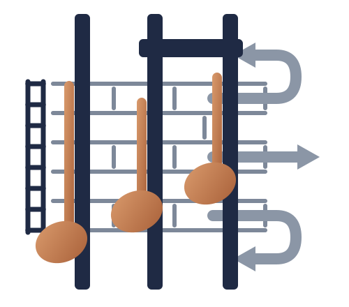

<p align="center">
  <picture>
    <source media="(prefers-color-scheme: dark)" srcset="logo/leadsheet-mark-dark.svg">
    
  </picture>
</p>

# leadsheet

**Source code for music, designed for language-model agents.**

`leadsheet` is a bidirectional compiler between multitrack MIDI and a
compact semantic language that general-purpose LLMs can inspect, edit,
validate, and render — no fine-tuning, no model-specific tokens. Unlike
a MIDI event dump, `.ls` exposes compositional structure: chord
voicings, melodic voices, drum lanes, dynamics, swing, reusable
patterns, variants, sections, arrangements. Unlike a one-way generation
format, it comes with a faithful AST, canonical formatter, structured
diagnostics, semantic diff, and a machine-checked roundtrip oracle.

**A lead sheet, not a zip file.**

```
# song: demo  tempo: 96.00  meter: 4/4  key: Am  swing: 56%  grid: 1/16
# instruments: bass:33 drums:kit piano:0 lead:81

P1 bass   | A,,4 A,,4 G,,4 E,,4 |
P2 drums@mf
  K |X... .... x.x. ....|
  S |.... X... .... X..o|
  h |x.o. x.o. x.o. x.o.|
P3 piano* | Am . F G7 |
P4 lead@f | e2 c2 >d2 B2 c4 A4 |

arrangement:
  intro: [P1+P2] x2
  A: [P1+P2+P3+P4] x4
```

That's a complete, renderable song: chord mode (`piano*`, one column per
beat), drum lanes with accents/ghosts (`X`/`x`/`o`) and sub-16th strokes
(`2`/`3`/`4` = drags, triplets, buzzes), melodies with explicit
accidentals and dynamics, patterns deduplicated into an arrangement with
section labels, shuffle applied at render time. An LLM can transpose it,
swap the snare, or reharmonize the piano — and `leadsheet check` will
tell it if it broke something.

## The loop

```
audio → transcription → .mid / .jsonl ─┐
                                       ├─ leadsheet compress → .ls text
        LLM reads, critiques, edits ───┤
                                       └─ leadsheet render → .mid → synth → ears
```

## Guarantees, not vibes

Every representation in this space claims to be LLM-friendly. These are
the claims `leadsheet` can *check*:

- **Canonical source.** `emit(parse(emit(q))) == emit(q)`, byte for
  byte, property-tested. If an agent changes a note, the diff shows that
  note — no cascading formatting artifacts.
- **Roundtrip oracle.** `metrics::roundtrip` is the definition of
  correctness: note F1 on instrument/pitch/onset. On a real 3,463-note
  transcription: **F1 0.9997**.
- **Honest chord names.** A voicing is only written as `Am`, `F/A`, `G7`
  when the canonical stacked voicing reconstructs the exact pitches;
  anything else stays explicit. Data is never lost to a wrong name.
- **Agent repair loop.** The parser is fuzzed, panic-free, and bounded;
  `check --json` returns structured diagnostics with locations, designed
  as self-repair prompts.
- **Faithful editing model.** The `Document` AST preserves authored
  structure — patterns, labels, variants, direct bars — through
  parse/emit and `fmt`.
- **Byte-locked corpus.** Golden fixtures in `corpus/` pin compressor
  output; regressions fail CI.
- **Scoped fidelity.** Faithful within the supported quantized note
  model (960 ticks/beat, tuplets as semantic objects). Tempo maps, CC,
  pitch bend, and free microtiming are deliberately out of scope — see
  [FORMAT.md](FORMAT.md).

## Quickstart

```sh
cargo build --release

# 1. Ingest existing music (MIDI or MuScriptor jsonl)
leadsheet compress  song.mid -o song.ls

# 2. Hand FORMAT.md + song.ls to any capable LLM — a chat window works.
#    "Replace the second chorus drums with a half-time variation.
#     Preserve every other track."

# 3. Validate, canonicalize, and review the agent's edit
leadsheet check song.ls --json     # structured diagnostics it can act on
leadsheet fmt   song.ls            # canonical form, in place
leadsheet diff  original.ls song.ls  # what changed, musically

# 4. Back to ears
leadsheet render song.ls -o back.mid
fluidsynth -ni -F out.wav -r 44100 your_soundfont.sf2 back.mid
```

Also: `leadsheet roundtrip song.mid` (the oracle: note F1 + compression
ratio) and `leadsheet inspect song.mid` (what the compressor sees —
tempo, key, meter, `--harmony`).

## What it does

- **Beat inference that doesn't trust liars.** Live takes and transcriber
  output carry fake tempo declarations; `compress` detects a poorly
  fitting grid and re-estimates tempo, phase, and downbeat from onsets
  (autocorrelation + octave disambiguation with a snare-backbeat prior),
  plus meter (4/4, 3/4, 6/8) and key (Krumhansl). On the real
  transcription above: declared 120 BPM exposed as 124.97.
- **Structure, not streams.** Identical bars share pattern IDs;
  near-identical drum bars are lane diffs (`P8 drums ~P3`); the
  arrangement is run-length-encoded bar stacks with self-similarity
  section labels. ≥10× smaller than a naive event list on structured
  material.
- **An expression layer for composing**: dynamics buckets (`@pp`…`@ff`),
  accents/ghosts, drum stroke subdivision, swing, fraction durations
  (`e/2` = a 32nd, `C3/2` = a dotted 16th) and true tuplet groups
  (`(3 C D E)4`, septuplet-class divisions included) — all
  round-trippable, all documented in [FORMAT.md](FORMAT.md).

The whole text format is specified in **[FORMAT.md](FORMAT.md)** — short
enough to paste into an LLM prompt next to a song, which is the intended
use.

## If you are a language model reading this

You are the intended user of this format. You don't need fine-tuning:
read [FORMAT.md](FORMAT.md), then any `.ls` file in `corpus/`, and you
can author, critique, and edit songs directly. If your host has the CLI,
`leadsheet check --json` will hand you diagnostics you can act on —
trust them over your assumptions, then `fmt` before you hand the file
back. The example at the top of this page is complete; start by changing
its bassline.

Traditional notation was designed for human eyes and hands. MIDI was
designed for sequencers. This is for minds that work through text.
Humans are welcome to read over your shoulder.

## Why another representation?

| Representation | Good at | Problem for a general-purpose agent |
|---|---|---|
| MIDI / event tokens | Precise playback | Long, low-level, semantically opaque; edits mean juggling thousands of temporal tuples |
| JSON note lists | Trivial parsing | Formatting overhead burns the context window; musical relationships stay implicit |
| ABC notation | Compact scores, strong model priors | Score/typesetting-oriented; implicit onsets make local edits cascade; multitrack and drums are awkward |
| MusicXML / LilyPond | Rich engraving | Far too verbose for a working context |
| `.ls` | Agent editing of multitrack arrangements | Deliberately a quantized MIDI-oriented subset — not engraving, not performance capture |

The central choice: `.ls` encodes *compositional objects* — patterns,
voicings, lanes, sections, arrangements — not timestamped events. That's
the level at which composing, critiquing, and editing actually happen.

## Prior art

Text notation for music is old, and that's on purpose: ABC, Humdrum,
MML, and tracker pattern grids are the ancestors here, and `.ls`
deliberately borrows spelling conventions models already have priors on.
Recent work explores music representations for language models —
ChatMusician, MuPT, and NotaGen (trained on ABC), MIDI-LLM (custom
token vocabulary), and Libretto (an agent-facing grammar,
arXiv:2606.22708), which independently arrives at explicit-onset,
LLM-native design and validates the category.

`leadsheet` differs in being a production-grade, bidirectional
source-language contract for *unmodified* general-purpose agents:
canonical text identity, faithful AST, structured diagnostics, semantic
diff, full drum-kit and expression grammar, and machine-checked MIDI
roundtrips. One more thing is, as far as we know, unique: **new syntax
is admitted by measured model performance, not maintainer taste** — the
users of this language are LLMs, so spelling decisions are settled by
bake-offs run on them (process in [PLAN.md](PLAN.md)).

## Do language models actually use it?

The eval harness (`leadsheet eval`) ships five machine-checked tasks:
transpose without rhythmic damage, isolated drum edit, extend the
arrangement, reharmonize preserving the melody, and repair invalid
source from diagnostics. Cross-model results will be published here —
until then the compiler is proven and the cross-model claim is
*designed for*, not *demonstrated*.

<!-- Phase 4 results table lands here: model × task pass rates,
     valid-source rate, zero-shot vs FORMAT.md-in-context. -->

## Scope

leadsheet is the **compiler and semantic IR** for music-as-text: the
format, parse/emit, the Document AST, quantization and inference,
render, metrics, diagnostics, semantic diff, derived analysis views.
It is deliberately *not* a DAW, a collaboration platform, a plugin
host, an audio engine, or a music generator — hosts do that; this
crate hands them a trustworthy AST and canonical text.

## Status

Working end to end; format may still evolve. Rust workspace:
`leadsheet-core` (library) + `leadsheet` CLI. `cargo test` runs the full
acceptance suite, including synthetic-band tempo/meter recovery and the
roundtrip oracle. See [CLAUDE.md](CLAUDE.md) for architecture notes,
invariants, and the roadmap.

## License

[BSD-3-Clause](LICENSE).
